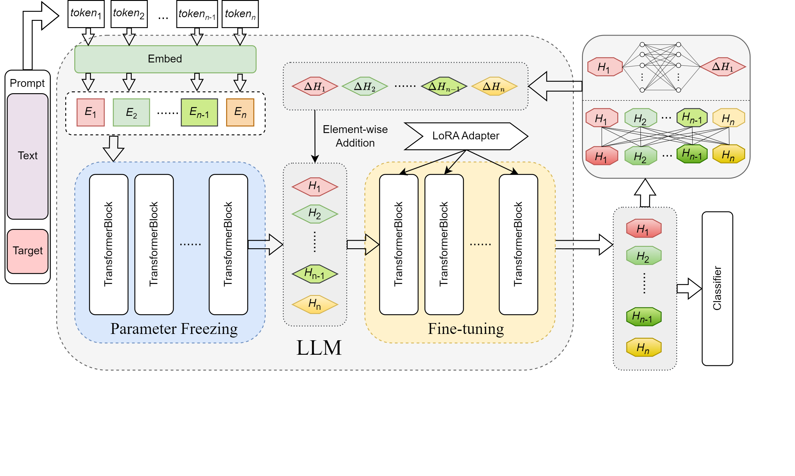

# LLM-InFeed  
### A Lightweight Large Language Model for Stance Detection Enhanced by Hidden-State Feedback  



## 📖 Introduction  
This repository contains the official implementation of the paper:  

> **A Lightweight Large Language Model for Stance Detection Enhanced by Implicit State Feedback**  
> *Wenqing Zhang, Yinglong Wang, Shijie Zhou, Jun Wang, Qiaolong Ding, Peiyi Zeng, Yue Wang, Chunjiang Wu*  
> *Peer-to-Peer Networking and Applications, 2025* [[DOI]](https://doi.org/10.1007/s12083-025-02081-x)  

Stance detection aims to determine the attitude (favorable, opposing, or neutral) expressed in a text towards a specific target. While lightweight large language models (LLMs) have shown promise for this task, they still suffer from **limited reasoning depth** and **end-layer inefficiency**.  

To address these challenges, our work introduces **InFeed**, a *multi-round hidden-state feedback framework*. By compressing semantic information from deep hidden states and injecting it back into intermediate layers, the model constructs iterative reasoning paths—mimicking human-like "repeated deliberation." This design enhances reasoning depth without significantly increasing model parameters, while activating underutilized representations in the terminal layers.  

Experiments across **P-Stance**, **SEM16**, and **VAST** datasets show that InFeed consistently improves stance classification accuracy and robustness, while maintaining efficiency.  

---

## 🚀 Features  
- **Multi-Round Feedback Enhancement**: Iteratively refines intermediate hidden states using end-layer semantics.  
- **Lightweight & Efficient**: Achieves performance gains without large computational overhead.  
- **Plug-and-Play Feedback Transformer**: Easily integrates with decoder-only and encoder-based models.  
- **Multi-Step Supervision**: Ensures stable gradient flow and robust semantic correction.  
- **Generalizable**: Demonstrated compatibility with LLaMA2-7B, Qwen2.5-7B, BERT-Large, and T5-Large.  

---

## ⚙️ Installation  

We recommend using Python ≥ 3.9 and PyTorch ≥ 2.1. Install dependencies with:  

```bash
pip install -r requirements.txt
```

Key dependency (must match version for reproducibility):
```bash
transformers==4.46.3
```
## 📂 Repository Structure
├── configs/           # Training configs
├── data/              # Dataset preparation scripts
├── models/            # Feedback transformer & classification head
├── trainer/           # Training and evaluation loop
├── utils/             # Helper functions
├── Feedback.png       # Method framework figure
└── main.py            # Entry point

## 📊 Datasets

We evaluate InFeed on three widely used stance detection benchmarks:

P-Stance: Political stance detection (Trump, Biden, Bernie).

SEM16: SemEval-2016 Task 6 (stance in tweets).

VAST: Multilingual stance dataset.

Please follow the instructions in data/README.md to preprocess datasets.

## 🧪 Reproducing Results

Example training (P-Stance, LLaMA2-7B backbone):

python main.py --config configs/pstance_llama2.yaml


Default: 2 feedback rounds (train), 3 feedback rounds (test).

Optimizer: Adam with cosine annealing (lr: 1e-4 → 1e-6).

Fine-tuning: LoRA applied to layers 22–32.

Expected results (average F1):

Model	P-Stance	SEM16	VAST
LLaMA2-7B + LLMEmbed	82.1	68.5	61.2
GPT-3.5 + COLA	83.4	70.9	62.3
LLaMA2-7B + InFeed (ours)	85.2	70.6	64.0

## 📌 Citation

If you find this work useful, please cite:
```bash
@article{zhang2025infeed,
  title={A lightweight large language model for stance detection enhanced by implicit state feedback},
  author={Zhang, Wenqing and Wang, Yinglong and Zhou, Shijie and Wang, Jun and Ding, Qiaolong and Zeng, Peiyi and Wang, Yue and Wu, Chunjiang},
  journal={Peer-to-Peer Networking and Applications},
  year={2025},
  volume={18},
  number={285},
  doi={10.1007/s12083-025-02081-x}
}
```
## 📬 Contact

For questions or collaborations, please contact:

Yinglong Wang – wangyinglong2023@gmail.com
